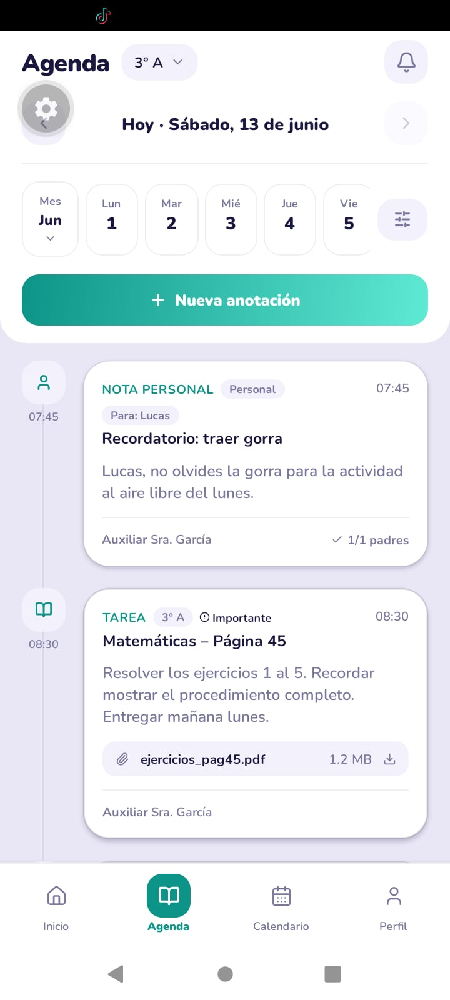
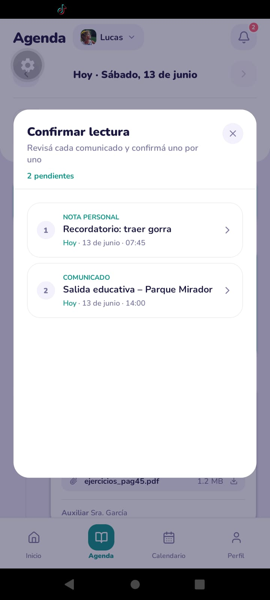

# Agenda Escolar Digital

App mobile (Expo / React Native) para gestión escolar: anotaciones, calendario, notificaciones y perfil. Incluye datos mock y arquitectura lista para conectar una API real.

**Stack:** Expo SDK 56 · React Native 0.85 · Expo Router · TypeScript · Nunito · Lucide icons

---

## Requisitos

- Node.js 18+
- pnpm (recomendado) o npm
- [Expo Go](https://expo.dev/go) en el teléfono, o emulador Android / iOS

## Inicio rápido

```bash
pnpm install
pnpm start
```

Escaneá el QR con Expo Go, o en la terminal: `a` (Android) · `i` (iOS).

Variables opcionales (copiá `.env.example` → `.env`):

| Variable | Default | Descripción |
|----------|---------|-------------|
| `EXPO_PUBLIC_USE_MOCK` | `true` | Datos en memoria vs API |
| `EXPO_PUBLIC_API_URL` | `https://api.example.com` | Base URL del backend |

---

## Roles y pantallas

| Tab | Auxiliar / docente | Padre | Alumno |
|-----|-------------------|-------|--------|
| **Inicio** | Resumen del día, secciones, accesos rápidos | Dashboard por hijo, banner de lecturas pendientes | Saludo y resumen propio |
| **Agenda** | Crear / editar anotaciones por sección | Solo lectura; confirmar lectura en comunicados | Solo lectura |
| **Calendario** | Crear eventos escolares | Ver eventos | Ver eventos |
| **Perfil** | Ajustes, modo oscuro, cerrar sesión | Idem + selector de hijos en otras pantallas | Idem |

### Flujos clave

- **Confirmar lectura (padre):** banner en Inicio/Agenda → lista guiada → detalle → botón *Confirmo que he leído*.
- **Seguimiento auxiliar:** en un comunicado con acuse, ver cuántos padres confirmaron (lista X/Y).
- **Nueva anotación:** botón flotante en Agenda (auxiliar) → tipos: tarea, comunicado, examen, etc.

> Fecha fija del mock: **13 de junio de 2026** (`TODAY` en `src/constants/config.ts`).

---

## Cuentas demo

Contraseña: **cualquier valor** (el mock no la valida).

| Rol | Email | Notas |
|-----|-------|-------|
| Auxiliar | `auxiliar@colegio.edu` | María García · secciones 3° A y 5° A/B/C |
| Padre | `padre@colegio.edu` | Carlos Rodríguez · hijos Lucas (3° A) y Emma (5° B) · **2 lecturas pendientes** |
| Padre (extra) | `padre2@colegio.edu` | Ana López · Sofía y Mateo |
| Alumno | `alumno@colegio.edu` | Lucas Rodríguez · 3° A |

Para probar listas largas de padres: comunicado `e-002` (30 familias en 3° A, 10 ya confirmaron).

---

## Capturas esenciales

### Login

<p align="center">
  
</p>

Pantalla de ingreso con cuentas demo.

### Inicio (padre)

<p align="center">
  
</p>

Dashboard del padre: selector de hijo, fecha del día y banner de lecturas pendientes.

### Inicio (auxiliar)

<p align="center">
  
</p>

Resumen del día, stats y accesos rápidos para el auxiliar/docente.

### Agenda

<p align="center">
  
</p>

Lista de anotaciones del día con filtros y tipos de entrada.

### Calendario

<p align="center">
  
</p>

Vista mensual con eventos del día seleccionado.

### Perfil

<p align="center">
  
</p>

Datos del usuario, rol, stats y ajustes (modo oscuro, cerrar sesión).

### Confirmar lectura (padre)

<p align="center">
  
</p>

Modal con lista numerada de comunicados pendientes de confirmar.

<p align="center">
  
</p>

Detalle del comunicado con botón *Confirmo que he leído*.

---

## Estructura del proyecto

```
app/                    # Rutas Expo Router (pantallas delgadas)
src/
  theme/                # Colores, tipografía, spacing, modo oscuro
  types/                # Tipos TypeScript
  constants/            # Config, labels, tipos de anotación
  data/mocks/           # Datos estáticos
  services/
    api/                # Stubs (firmas de endpoints reales)
    mocks/              # Store en memoria
  contexts/             # AuthContext, AppDataContext
  components/
    ui/                 # Button, Modal, TodayDateText, etc.
    features/           # EntryCard, PendingAckGuideModal, etc.
    layout/             # TopBar, HomeTopBar
  features/             # Pantallas por dominio (auth, agenda, profile…)
  utils/                # Fechas, visibilidad, ack de lectura
assets/                 # Iconos, splash, avatares mock
docs/screenshots/       # Capturas para este README
```

Las pantallas **no importan mocks directamente**; usan `useAuth()` y `useAppData()`.

---

## Tema global

Todo el diseño pasa por `src/theme/`:

- `light.ts` / `dark.ts` — paletas claro y oscuro
- `ThemeProvider` + `useTheme()` — persistido en AsyncStorage
- `styles.ts` — helpers (`selectionStyle`, `datePillStyle`, `cardShadow`)

---

## Mock → API

Por defecto `USE_MOCK = true` en `src/constants/config.ts`.

Para API real:

1. Implementar funciones en `src/services/api/*.api.ts`
2. Definir `EXPO_PUBLIC_API_URL` en `.env`
3. Poner `EXPO_PUBLIC_USE_MOCK=false`

| Servicio | Funciones stub | Endpoint |
|----------|----------------|----------|
| auth | login, logout, getSession, changePassword | `/auth/*` |
| entries | CRUD + confirmEntryRead | `/entries` |
| calendar | CRUD eventos | `/calendar/events` |
| notifications | list, markAsRead | `/notifications` |
| chat | conversaciones y mensajes | `/conversations` |
| students | alumnos y padres por sección | `/students`, `/parents` |

---

## Scripts

| Comando | Descripción |
|---------|-------------|
| `pnpm start` | Servidor de desarrollo Expo |
| `pnpm android` | Abrir en Android |
| `pnpm ios` | Abrir en iOS |
| `pnpm lint` | Chequeo TypeScript (`tsc --noEmit`) |

---
