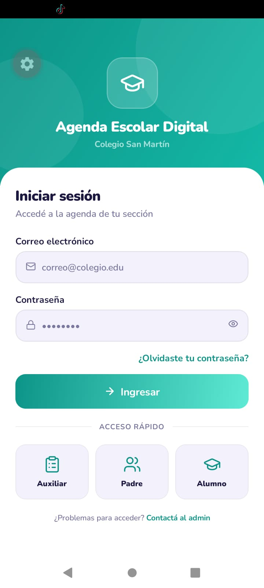
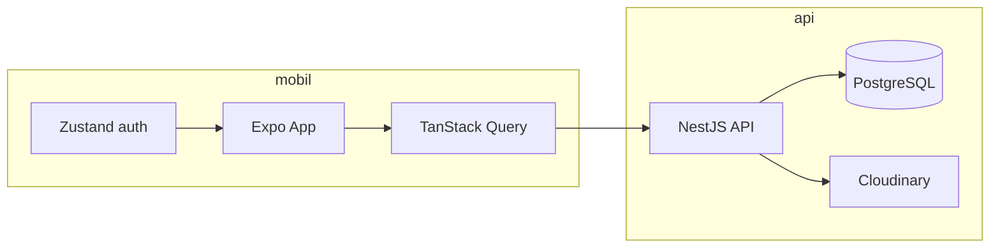

# Agenda Escolar Digital

Plataforma para colegios que conecta **auxiliares/docentes**, **padres** y **alumnos** con agenda diaria, calendario escolar, comunicados con acuse de lectura, notificaciones in-app y adjuntos (fotos, PDF, Word).

Monorepo con backend **NestJS** y app móvil **Expo / React Native**.

<p align="center">
  <a href="https://www.linkedin.com/posts/claudio-angelo-chumpitaz-flores-29b069252_edtech-reactnative-tanstackquery-ugcPost-7473509701650042880-LS-x/" target="_blank">
    
  </a>
  <br>
  <sub><a href="https://www.linkedin.com/posts/claudio-angelo-chumpitaz-flores-29b069252_edtech-reactnative-tanstackquery-ugcPost-7473509701650042880-LS-x/" target="_blank">Ver demo en LinkedIn</a></sub>
</p>

---

## Estructura del repositorio

```
Agendaescolardigital/
├── api/          # API REST (NestJS + PostgreSQL + Cloudinary)
├── mobil/        # App móvil (Expo Router + Zustand + TanStack Query)
└── README.md     # Este archivo
```

| Carpeta | Descripción |
|---------|-------------|
| [`api/`](api/) | Backend: auth JWT, RBAC, entries, calendario, adjuntos, notificaciones, chat |
| [`mobil/`](mobil/) | Cliente móvil para auxiliar, padre y alumno |

Documentación detallada por paquete:

- [API — setup y base de datos](api/README.md)
- [Móvil — roles, pantallas y mock](mobil/README.md)
- [Modelo de datos](api/database/docs/relaciones.md)
- [Permisos y endpoints](api/docs/endpoints-permissions.md)

---

## Stack tecnológico

| Capa | Tecnologías |
|------|-------------|
| **API** | NestJS 11, TypeORM, PostgreSQL, JWT, Cloudinary, Pino, Scalar (docs en dev) |
| **Móvil** | Expo SDK 56, React Native, Expo Router, Zustand, TanStack Query |
| **Auth** | Login por código (`t…` / `p…` / `e…`) + contraseña |
| **Adjuntos** | Cloudinary (máx. 10 MB — imagen, PDF, Word) |

---

## Funcionalidades principales

- **Agenda:** tareas, comunicados, materiales, observaciones, exámenes, etc., por sección
- **Calendario escolar:** festivos, reuniones, actuaciones, eventos institucionales
- **Acuse de lectura:** padres confirman comunicados; auxiliar ve pendientes
- **Adjuntos:** cámara, galería o archivo; imágenes con visor in-app; PDF/Word se abren en app externa
- **Notificaciones in-app:** bandeja al publicar (sin push al teléfono)
- **Perfil:** avatar, cambio de contraseña, modo oscuro
- **Roles:** auxiliar (gestión), padre (lectura + ack), alumno (lectura)

---

## Inicio rápido (desarrollo)

### 1. API

```bash
cd api
pnpm install
cp .env.example .env
pnpm db:up          # Postgres en Docker (puerto 5434)
pnpm db:migrate
pnpm db:seed:dev    # opcional — datos demo
pnpm start:dev      # http://localhost:3000 — docs en http://localhost:3000/api (solo dev)
```

Completá `CLOUDINARY_*` en `.env` para adjuntos y avatares.

### 2. Móvil

```bash
cd mobil
pnpm install
cp .env.example .env
```

En `mobil/.env`:

```env
EXPO_PUBLIC_USE_MOCK=false
EXPO_PUBLIC_API_URL=http://10.0.2.2:3000   # emulador Android
# EXPO_PUBLIC_API_URL=http://<IP-LAN>:3000  # dispositivo físico
```

```bash
pnpm start
```

Escaneá el QR con Expo Go o `a` (Android) / `i` (iOS).

---

## Cuentas de demo (API + seed)

Contraseña: **`demo123`**

| Código | Rol |
|--------|-----|
| `t10000001` | Auxiliar |
| `p10000001` | Padre |
| `e10000001` | Alumno |

Con `EXPO_PUBLIC_USE_MOCK=true` el móvil usa datos en memoria y no requiere API.

---

## Comandos útiles

| Dónde | Comando | Qué hace |
|-------|---------|----------|
| `api/` | `pnpm db:setup` | Migrar + seed |
| `api/` | `pnpm lint` | ESLint |
| `api/` | `pnpm test` | Tests unitarios |
| `mobil/` | `pnpm lint` | TypeScript (`tsc --noEmit`) |
| `mobil/` | `pnpm build:apk:local` | APK release local |

---

## Arquitectura (resumen)



- El móvil consume la API con JWT (access + refresh).
- Los adjuntos se suben a Cloudinary; la API guarda metadata en Postgres.
- Las notificaciones son **in-app** (polling al abrir la bandeja), no push nativo.

---

## Licencia

Proyecto privado — uso interno / educativo.
