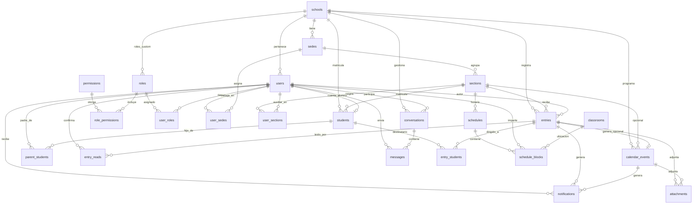
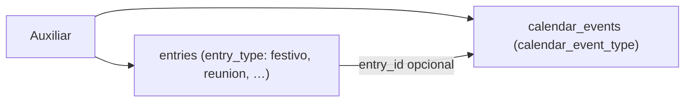
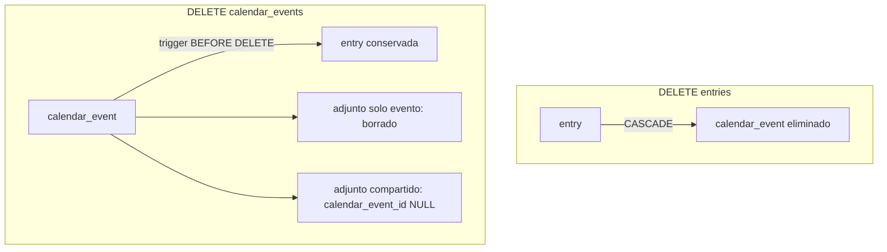

# Relaciones del modelo de datos

Esquema derivado de los tipos TypeScript (`src/types/`), los mocks (`src/data/mocks/`) y las pantallas móviles de Expo Router. Migraciones en [`../migrations/`](../migrations/).

---

## Diagrama general



---

## Entidades principales

| Tabla | Equivalente en la app | Descripción |
|-------|----------------------|-------------|
| `schools` | (implícito) | Colegio / institución. |
| `sedes` | — | Campus del colegio (Los Olivos, Surco, …). |
| `sections` | `Child.section`, `User.sections[]` | Salón dentro de una sede: ej. `3° A – Primaria`. |
| `users` | `User` | Cuenta con `code` único (`e…` alumno, `t…` trabajador, `p…` padre). Login: `code` + contraseña. |
| `permissions` | — | Catálogo de permisos (`entries.create`, `calendar.read`, …). |
| `roles` | `User.role` (antes enum) | Roles del sistema (`school_id` NULL) o custom por colegio. |
| `user_roles` | — | N:M usuario ↔ rol. Un usuario puede tener varios roles. |
| `role_permissions` | — | N:M rol ↔ permiso. Define qué puede hacer cada rol. |
| `students` | `Child` | Matrícula del alumno; nombre/iniciales/avatar en `users` vía `user_id`. |
| `entries` | `Entry` | Anotaciones de agenda (tarea, comunicado, etc.). |
| `calendar_events` | `CalendarEvent` | Eventos del calendario escolar. |
| `schedules` / `schedule_blocks` | (futuro) | Horario semanal por sección. |
| `classrooms` | (futuro) | Aulas/salones del colegio. |
| `attachments` | `Attachment` | Adjuntos de entries o calendar_events (tabla unificada). |
| `notifications` | `AppNotification` | Avisos push/in-app por usuario. |
| `conversations` / `messages` | `Conversation` / `Message` | Chat auxiliar ↔ padres. |

---

## Cambios respecto a la versión anterior

| Antes | Ahora | Motivo |
|-------|-------|--------|
| `entry_attachments` + `calendar_event_attachments` | `attachments` unificada | Menos duplicación; un solo servicio de upload |
| Sin horarios | `schedules` + `schedule_blocks` | Extensión futura (horario de clases) |
| Sin `users.role` (enum) | `permissions` + `roles` + `user_roles` | RBAC escalable; nuevos permisos sin migrar columnas |
| `schools → sections` | `schools → sedes → sections` | Un colegio con varias sedes; sección pertenece a sede |
| `username` por colegio | `users.code` único (`e/t/p…`) | Login tipo universidad; sin `schoolSlug` |
| `calendar_events.entry_id` opcional | Vínculo con `entries` | Política asimétrica: borrar **entry** elimina el evento; borrar **evento** conserva la entry (`../migrations/R__triggers.sql`) |
| `notifications` solo con `entry_id` | También `calendar_event_id` | Avisos de calendario |

---

## Tipos: `entry_type` vs `calendar_event_type`

Son **dos enums distintos** con roles diferentes:

| Enum | Tabla(s) | Qué representa |
|------|----------|----------------|
| **`entry_type`** | `entries.type`, `notifications.type` | **Todos** los tipos posibles: agenda diaria + calendario escolar |
| **`calendar_event_type`** | `calendar_events.type` | **Solo** tipos del calendario institucional |

### `entry_type` (agenda = anuncio de qué se hizo)

Incluye **todo** lo que puede aparecer como registro en la agenda:

```
tarea, comunicado, material, observacion, recordatorio,
examen, evento, nota_personal, personalizado,
festivo, reunion, actuacion
```

Cuando el auxiliar crea algo (Registro **o** Calendario en Nueva anotación), la **entry** es el anuncio en la agenda: *“se programó un festivo”*, *“se cargó una tarea”*, etc. Por eso los tipos de calendario también viven acá.

### `calendar_event_type` (solo calendario escolar)

Subconjunto usado **únicamente** en la tabla `calendar_events`:

```
festivo, examen, reunion, actuacion, evento
```

No incluye `tarea`, `comunicado`, `material`, etc. — esos no son eventos del calendario institucional.

### Flujo Nueva anotación → pestaña Calendario



1. Se crea **`calendar_events`** con `entry_id = NULL` → aparece solo en Calendario (festivos, reuniones institucionales, etc.).
2. Opcionalmente se crea **`entries`** (anuncio en agenda) y se actualiza `calendar_events.entry_id` para vincularlos.
3. Política de borrado asimétrica (ver sección siguiente).

---

## Borrado entry ↔ calendar_event

Vínculo opcional: `calendar_events.entry_id → entries.id` con **política distinta según quién se borra**.

| Acción | Qué pasa | Mecanismo |
|--------|----------|-----------|
| **DELETE entry** | Se elimina también el `calendar_event` vinculado | `ON DELETE CASCADE` en `calendar_events.entry_id` |
| **DELETE calendar_event** | La **entry se conserva** en agenda | Sin FK inversa; trigger `trg_calendar_events_before_delete` |
| Adjuntos solo del evento | Se eliminan con el evento | `attachments.calendar_event_id ON DELETE CASCADE` |
| Adjuntos compartidos (entry + evento) | Permanecen bajo la entry; se anula `calendar_event_id` | Trigger `fn_calendar_event_before_delete` (BEFORE DELETE) |
| Notificaciones del evento | Permanecen; `calendar_event_id` → NULL | `notifications.calendar_event_id ON DELETE SET NULL` |



**Implementación:** `../migrations/R__triggers.sql` — no duplicar esta lógica solo en la app Nest; la BD es la fuente de verdad.

**App (Nest):** `DELETE /calendar/events/:id` debe ser un borrado simple del evento; no intentar borrar la entry. Si la UX pide “quitar de calendario pero dejar en agenda”, es el caso por defecto.

---

## Actualización entry ↔ calendar_event

Si `calendar_events.entry_id` apunta a una entry, **ambos registros se mantienen alineados** al editar cualquiera de los dos (triggers AFTER UPDATE en `../migrations/R__triggers.sql`).

| Campo entry | Campo calendar_event | Notas |
|-------------|----------------------|-------|
| `title` | `title` | |
| `description` | `description` | En entry siempre TEXT NOT NULL |
| `entry_date` | `event_date` | |
| `entry_time` | `event_time` | Default `08:00` si el evento no tiene hora |
| `section_id` | `section_id` | Si el evento tiene `section_id` NULL, no se pisa la sección de la entry |
| `author_id` | `author_id` | Si el evento tiene `author_id` NULL, se conserva el de la entry |
| `school_id` | `school_id` | |
| `type` | `type` | Solo tipos calendario (`festivo`, `examen`, …). Si la entry es `tarea`/`comunicado`, el `type` del evento **no cambia** al editar la entry |

**No se sincronizan** (solo agenda): `is_important`, `parents_only`, `requires_ack`, `entry_students`, `entry_reads`.

**Anti-bucle:** `pg_trigger_depth()` — la actualización en cascada no dispara un segundo ciclo.

**App (Nest):** `PATCH /entries/:id` o `PATCH /calendar/events/:id` puede enviar solo los campos editados; la BD replica al par vinculado. No hace falta doble PATCH desde el cliente.

---

## Relaciones detalladas

### Colegio, sedes y secciones

```
schools 1 ── * sedes 1 ── * sections
```

- Un colegio tiene varias **sedes** (campus).
- Cada **sección** pertenece a una sede (`sections.sede_id`).
- `students.section_id` → sede deducible vía sección.

### Login

```
POST /auth/login { code, password }
```

- `code` único: `e10000001` (alumno), `t10000001` (trabajador), `p10000001` (padre).
- Sin `schoolSlug`; el colegio se deduce del usuario en BD.

### Colegio y secciones (legacy — ver sedes arriba)
### IAM: roles y permisos (RBAC)

```
permissions 1 ── * role_permissions * ── 1 roles
users * ── * roles   via user_roles
roles.school_id NULL → rol global del sistema (auxiliar, padre, …)
roles.school_id set  → rol custom del colegio (opcional, futuro)
```

| Rol (`roles.code`) | Permisos destacados | Relación de datos |
|--------------------|---------------------|-------------------|
| **auxiliar** | CRUD agenda/calendario, chat, horarios | `user_sections` (N:M) |
| **padre** | Leer agenda, ack, calendario, chat | `parent_students` → hijo activo |
| **alumno** | Leer agenda y calendario | `students.user_id` → cuenta |
| **profesor** | Leer/crear entries, horarios, chat | `user_sections` (N:M) |
| **direccion** | Todos los permisos del catálogo | `school_id`; sin filtro de sección |

**Consultas útiles:**

- `v_user_roles` — roles asignados a cada usuario.
- `v_user_permissions` — permisos efectivos (usuario → rol → permiso).

**En la API Nest:** validar con `@RequirePermission('entries.create')` (guard) leyendo `v_user_permissions` o cache en JWT/sesión.

### Usuarios y alcance por rol (datos, no permisos)

### Padres e hijos

```
users (padre) * ── * students   via parent_students
students * ── 1 sections
```

- Un padre puede tener varios hijos (`Carlos → Lucas + Emma`).
- Un hijo puede tener varios padres (madre + padre), aunque el mock solo modela uno.

### Auxiliar y secciones

```
users (auxiliar) * ── * sections   via user_sections
```

- Reemplaza `User.sections[]` del mock.
- Filtra stats, agenda y formulario de nueva anotación por sección activa.

### Entradas (agenda)

```
entries * ── 1 sections
entries * ── 1 users (author)
entries * ── * students   via entry_students (opcional)
entries 1 ── * attachments
entries * ── * users      via entry_reads (confirmación)
```

| Campo `entries` | Campo app `Entry` | Notas |
|-----------------|-------------------|-------|
| `type` | `type` | Todos los tipos (`entry_type`), incl. festivo/reunión/actuación si viene del calendario |
| `entry_date` / `entry_time` | `date` / `time` | |
| `is_important` | `isImportant` | |
| `parents_only` | `parentsOnly` | Oculto al alumno |
| `requires_ack` | `requiresAck` | Pide confirmar lectura al padre |
| `entry_students` | `studentId` / `studentIds` | Vacío = toda la sección |

**Visibilidad** (ver `src/utils/visibility.ts`):

| Rol | Regla |
|-----|-------|
| Auxiliar | Solo secciones en `user_sections`; opcionalmente filtra por sección seleccionada |
| Alumno | Misma sección; excluye `parents_only`; si hay `entry_students`, solo si está incluido |
| Padre | Misma sección del hijo activo; si hay `entry_students`, solo si el hijo está incluido |

### Confirmación de lectura

```
entry_reads (entry_id, user_id, read_at)
```

- Equivalente a `Entry.readBy: string[]`.
- API: `POST /entries/:id/read`.
- Pantallas: badge en tarjeta, modal de detalle, lista de pendientes del auxiliar.

### Calendario escolar

```
calendar_events * ── 1 schools
calendar_events * ── 0..1 sections   (NULL = evento de todo el colegio)
calendar_events * ── 0..1 entries    (entry_id opcional; borrado asimétrico, ver § Borrado entry ↔ calendar_event)
calendar_events 1 ── * attachments
```

- Separado de `entries` en la UI (agenda vs calendario), pero pueden vincularse.
- Si el auxiliar crea un evento desde **Nueva anotación → Calendario**, guardá `entry_id`.
- Al **eliminar la entry**, el evento de calendario asociado se borra solo (cascada).
- Al **eliminar el evento**, la entry en agenda **permanece** (trigger en `R__triggers.sql`).
- Si están vinculados (`entry_id`), **editar uno actualiza el otro** (triggers AFTER UPDATE en `../migrations/R__triggers.sql`).
- Eventos institucionales sin entry dejan `entry_id = NULL`.

### Horarios de clase (futuro)

```
schedules * ── 1 sections
schedules 1 ── * schedule_blocks
schedule_blocks.day → day_of_week
schedule_blocks.teacher_id → users (profesor/auxiliar, opcional)
schedule_blocks.classroom_id → classrooms (opcional)
classrooms * ── 1 schools
```

- No está en la app móvil aún.
- Vista SQL: `v_section_schedule` (incluye `teacher_name` y `classroom_name` vía join).
- Separado de `calendar_events` (institucional vs grilla semanal).

### Adjuntos unificados

```
attachments.entry_id          → entries (opcional)
attachments.calendar_event_id → calendar_events (opcional)
```

Regla CHECK: **al menos uno** de los dos FK debe estar presente (solo entry, solo calendario, o **ambos** si entry y evento están vinculados).

### Notificaciones

```
notifications * ── 1 users
notifications * ── 0..1 entries
notifications * ── 0..1 calendar_events
```

- Campos `title`, `body`, `type` alineados con `AppNotification`.
- Se generan al crear/editar entradas o eventos relevantes.
- Pantalla modal **Notificaciones**.

### Chat

```
conversations: assistant_id + participant_id (padre)
messages * ── 1 conversations
messages * ── 1 users (sender)
```

- Una conversación por par auxiliar–padre.
- `unreadCount` se calcula contando `messages.is_read = false` del otro participante.

---

## Pantallas → tablas

| Ruta / pantalla | Tablas principales | Endpoints API |
|-----------------|-------------------|---------------|
| `(auth)/login` | `users.code`, `users.password_hash` | `POST /auth/login` |
| `(tabs)/index` | `entries`, `calendar_events`, `notifications` | `GET /entries`, `GET /calendar/events` |
| `(tabs)/agenda` | `entries`, `entry_reads`, `students` | `GET /entries?section&childId&date` |
| `(tabs)/calendario` | `calendar_events` | `GET /calendar/events` |
| `(tabs)/perfil` | `users` | `GET /users/me` |
| `(modals)/nueva-anotacion` | `entries`, `entry_students`, `attachments`, `calendar_events` | `POST /entries`, `POST /calendar/events` |
| `(modals)/notificaciones` | `notifications` | `GET /notifications` |
| `(modals)/cambiar-contrasena` | `users.password_hash` | `PATCH /auth/password` |
| Modales de detalle (Entry / Calendar) | `entries`, `calendar_events`, `attachments` | `PATCH`, `DELETE` |
| Chat (futuro) | `conversations`, `messages` | `GET /conversations` |
| Horario (futuro) | `schedules`, `schedule_blocks` | `GET /schedules?section=` |

---

## Vistas SQL incluidas

| Vista | Uso |
|-------|-----|
| `v_student_agenda` | Feed de agenda para cuenta alumno |
| `v_parent_agenda` | Feed filtrado por hijo + estado de ack |
| `v_pending_entry_acks` | Comunicados de sección sin confirmar (auxiliar) |
| `v_pending_student_entry_acks` | Comunicados a alumno específico |
| `v_calendar_feed` | Listado de calendario |
| `v_section_schedule` | Grilla horaria por sección |
| `v_unread_notifications` | Badge de notificaciones |
| `v_assistant_section_stats` | Resumen del dashboard auxiliar |
| `v_user_roles` | Roles asignados por usuario |
| `v_user_permissions` | Permisos efectivos (RBAC) |

---

## Índices definidos

- `entries(section_id, entry_date)` — agenda por sección
- `entry_reads(user_id)` — ack del padre
- `entry_students(student_id)` — filtro por hijo
- `notifications(user_id, is_read)` — bandeja
- `calendar_events(school_id, event_date)` — calendario mensual
- `attachments(entry_id)` / `attachments(calendar_event_id)` — adjuntos parciales
- `schedule_blocks(schedule_id, day, starts_at)` — horario semanal

---

## Próximos pasos (backend)

1. Desde `api/`: `pnpm db:migrate` (Flyway). Datos demo: `pnpm db:seed:dev`.
2. Mapear UUID ↔ IDs string del mock solo en la capa API si hace falta compatibilidad temporal.
3. Implementar RLS o filtros por `school_id` en cada query (multi-tenant).
4. Sustituir stubs en `src/services/api/*.api.ts` con `apiFetch` real.
5. Subir adjuntos a Azure Blob Storage y guardar `storage_url` en `attachments`.
