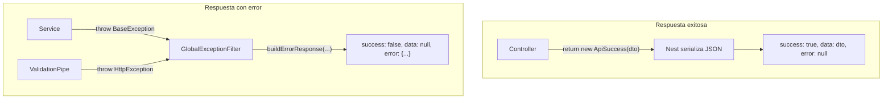

# ApiResponse y ApiError — envelope HTTP

Contrato uniforme de respuestas en la API Nest (`api/`). Regla Cursor: [`.cursor/rules/nest-api-response.mdc`](../../.cursor/rules/nest-api-response.mdc).

Relacionado: [`logging.md`](./logging.md) (cómo se loguean errores) · [`auth-login.md`](./auth-login.md) (ejemplos auth).

---

## Resumen

Toda respuesta HTTP — éxito o error — usa el **mismo envelope JSON**:

```json
{
  "success": true,
  "data": { ... },
  "error": null
}
```

```json
{
  "success": false,
  "data": null,
  "error": {
    "code": "INVALID_CREDENTIALS",
    "message": "Invalid credentials",
    "detail": null
  }
}
```

| Campo | Éxito | Error |
|-------|-------|-------|
| `success` | `true` | `false` |
| `data` | payload del endpoint | siempre `null` |
| `error` | siempre `null` | objeto `ApiError` |

El **status HTTP** sigue siendo el de REST (200, 201, 400, 401, 404, 500…). El envelope no reemplaza el código HTTP; lo complementa para que el cliente móvil siempre parsee igual.

---

## Flujo



1. **Controller** envuelve datos en `ApiSuccess`.
2. **Service** lanza `BaseException` (nunca arma JSON de error).
3. **`GlobalExceptionFilter`** captura excepciones y responde con `buildErrorResponse`.
4. **Validación DTO** (`ValidationPipe`) → `HttpException` → filtro → `INVALID_REQUEST`.

Implementación: [`api/src/shared/`](../src/shared/).

---

## Tipos (`shared/response/`)

### `ApiResponse<T>`

Interfaz del envelope ([`api-response.ts`](../src/shared/response/api-response.ts)):

```typescript
interface ApiResponse<T> {
  success: boolean;
  data: T | null;
  error: ApiError | null;
}
```

### `ApiSuccess<T>`

Clase para respuestas OK ([`api-success.ts`](../src/shared/response/api-success.ts)):

```typescript
export class ApiSuccess<T> implements ApiResponse<T> {
  readonly success = true;
  readonly error = null;
  constructor(readonly data: T) {}
}
```

Uso en controller:

```typescript
@Get('me')
getMe(): ApiSuccess<UserProfileDto> {
  return new ApiSuccess(this.usersService.findProfileById(userId));
}
```

### `ApiError`

Clase del bloque de error ([`api-error.ts`](../src/shared/response/api-error.ts)):

| Propiedad | Tipo | Descripción |
|-----------|------|-------------|
| `code` | `string` | Identificador estable para la app (enum en cliente) |
| `message` | `string` | Mensaje genérico en inglés (catálogo) |
| `detail` | `string \| null` | Contexto extra (validación, id, motivo) — opcional |

No se instancia en controllers. La crea `buildErrorResponse()` dentro del filtro global.

### `buildErrorResponse()`

Helper usado solo por [`GlobalExceptionFilter`](../src/shared/filters/global-exception.filter.ts):

```typescript
buildErrorResponse(code, message, detail): ApiResponse<null>
```

---

## Errores de dominio

### `ErrorCode`

Catálogo central ([`error-code.ts`](../src/shared/error/error-code.ts)). Cada entrada tiene `code` + `message`:

| Clave | code | message | HTTP típico |
|-------|------|---------|-------------|
| `USER_NOT_FOUND` | `USER_NOT_FOUND` | User not found | 404 |
| `INVALID_REQUEST` | `INVALID_REQUEST` | Invalid request | 400 |
| `INVALID_CREDENTIALS` | `INVALID_CREDENTIALS` | Invalid credentials | 401 |
| `USER_INACTIVE` | `USER_INACTIVE` | User account is inactive | 403 |
| `INVALID_REFRESH_TOKEN` | `INVALID_REFRESH_TOKEN` | Invalid refresh token | 401 |
| `UNAUTHORIZED` | `UNAUTHORIZED` | Unauthorized | 401 |
| `ORDER_NOT_FOUND` | `ORDER_NOT_FOUND` | Order not found | 404 |
| `INTERNAL_ERROR` | `INTERNAL_ERROR` | Internal server error | 500 |

Añadir fila aquí **antes** de crear una excepción nueva.

### `BaseException`

Clase base ([`base.exception.ts`](../src/shared/exception/base.exception.ts)):

```typescript
throw new UserNotFoundException(userId);
// → HTTP 404 + envelope con code USER_NOT_FOUND
```

Parámetros: `errorCode`, `detail` (opcional), `status` (default 400).

### Excepciones implementadas

| Clase | ErrorCode | HTTP | detail |
|-------|-----------|------|--------|
| `InvalidCredentialsException` | `INVALID_CREDENTIALS` | 401 | `null` |
| `InvalidRefreshTokenException` | `INVALID_REFRESH_TOKEN` | 401 | opcional (ej. reuse) |
| `UnauthorizedAccessException` | `UNAUTHORIZED` | 401 | mensaje JWT / guard |
| `UserInactiveException` | `USER_INACTIVE` | 403 | `User id: … is inactive` |
| `UserNotFoundException` | `USER_NOT_FOUND` | 404 | `User id: … not found` |

Exportadas en [`shared/exception/index.ts`](../src/shared/exception/index.ts).

---

## `GlobalExceptionFilter`

Registrado como `APP_FILTER` en [`app.module.ts`](../src/app.module.ts).

| Excepción capturada | HTTP | error.code | detail |
|---------------------|------|------------|--------|
| `BaseException` | la de la clase | `errorCode.code` | `exception.detail` |
| `HttpException` (validación, etc.) | la del exception | `INVALID_REQUEST` | mensajes de validación unidos |
| Cualquier otra (500) | 500 | `INTERNAL_ERROR` | `exception.message` |

Logging asociado: ver [`logging.md`](./logging.md#capa-errores).

---

## Casos especiales

### Validación DTO (`ValidationPipe`)

Request con body inválido → **400** +:

```json
{
  "success": false,
  "data": null,
  "error": {
    "code": "INVALID_REQUEST",
    "message": "Invalid request",
    "detail": "code must start with e, t or p followed by digits, password must be longer than..."
  }
}
```

Configuración en [`main.ts`](../src/main.ts): `whitelist`, `forbidNonWhitelisted`, `transform`.

### JWT / rutas protegidas

Sin token o token inválido → `JwtAuthGuard` lanza `UnauthorizedAccessException` → **401** + `UNAUTHORIZED`.

Rutas `@Public()` no pasan por validación JWT.

### Errores 500

El cliente recibe `INTERNAL_ERROR` genérico. El stack completo solo va al log (`error`), no al JSON de respuesta en producción.

---

## Responsabilidades por capa

| Capa | Éxito | Error |
|------|-------|-------|
| **Controller** | `return new ApiSuccess(dto)` | no construye errores |
| **Service** | retorna DTO / void | `throw new XxxException(...)` |
| **Filter** | — | arma envelope con `buildErrorResponse` |
| **App móvil** | lee `data` si `success === true` | lee `error.code` / `error.detail` |

```typescript
// ✅ Controller
return new ApiSuccess(await this.authService.login(dto));

// ✅ Service
if (!user) throw new InvalidCredentialsException();

// ❌ Controller
return user;
throw new NotFoundException();

// ❌ Service
return new ApiSuccess(user);
```

---

## Añadir un error nuevo

1. Entrada en [`ErrorCode`](../src/shared/error/error-code.ts).
2. Clase en [`shared/exception/`](../src/shared/exception/) extendiendo `BaseException` con el `HttpStatus` correcto.
3. Export en [`shared/exception/index.ts`](../src/shared/exception/index.ts).
4. Lanzar desde el service; el filtro serializa solo.
5. Test e2e: comprobar `success: false` y `error.code`.
6. Documentar fila en la tabla de este archivo.

Ejemplo:

```typescript
// error-code.ts
ENTRY_NOT_FOUND: new ErrorCodeEntry('ENTRY_NOT_FOUND', 'Entry not found'),

// entry-not-found.exception.ts
export class EntryNotFoundException extends BaseException {
  constructor(entryId: string) {
    super(ErrorCode.ENTRY_NOT_FOUND, `Entry id: ${entryId}`, HttpStatus.NOT_FOUND);
  }
}
```

---

## Ejemplos HTTP reales

### GET `/` (público)

**200**

```json
{
  "success": true,
  "data": { "message": "Hello World!" },
  "error": null
}
```

### POST `/auth/login` credenciales inválidas

**401**

```json
{
  "success": false,
  "data": null,
  "error": {
    "code": "INVALID_CREDENTIALS",
    "message": "Invalid credentials",
    "detail": null
  }
}
```

### GET `/users/me` sin token

**401**

```json
{
  "success": false,
  "data": null,
  "error": {
    "code": "UNAUTHORIZED",
    "message": "Unauthorized",
    "detail": null
  }
}
```

### POST `/auth/login` body inválido

**400**

```json
{
  "success": false,
  "data": null,
  "error": {
    "code": "INVALID_REQUEST",
    "message": "Invalid request",
    "detail": "code must start with e, t or p followed by digits"
  }
}
```

---

## Tests

Los e2e esperan el envelope ([`auth.e2e-spec.ts`](../test/auth.e2e-spec.ts)):

```typescript
interface ApiEnvelope<T = unknown> {
  success: boolean;
  data: T | null;
  error: { code: string; message: string; detail: string | null } | null;
}
```

Al montar app de prueba, registrar `GlobalExceptionFilter` (y `ValidationPipe`) igual que en producción.

---

## Checklist al crear endpoint

- [ ] Controller retorna `ApiSuccess<T>`
- [ ] Service lanza `BaseException` en reglas de negocio
- [ ] Código nuevo en `ErrorCode` + excepción en `shared/exception/`
- [ ] Tests esperan `{ success, data, error }`
- [ ] Permisos: [`endpoints-permissions.md`](./endpoints-permissions.md)
- [ ] Logging: [`logging.md`](./logging.md)

---

## Referencias de código

| Archivo | Rol |
|---------|-----|
| [`shared/response/`](../src/shared/response/) | `ApiSuccess`, `ApiError`, `buildErrorResponse` |
| [`shared/error/error-code.ts`](../src/shared/error/error-code.ts) | Catálogo de códigos |
| [`shared/exception/`](../src/shared/exception/) | Excepciones de dominio |
| [`shared/filters/global-exception.filter.ts`](../src/shared/filters/global-exception.filter.ts) | Serialización de errores |
| [`app.controller.ts`](../src/app.controller.ts) | Ejemplo mínimo de éxito |
