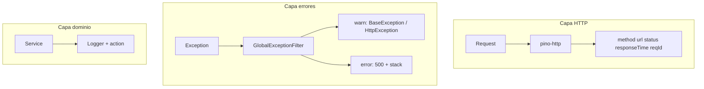

# Logging — API Nest

Guía de logging estructurado en `api/`. Regla Cursor para el agente: [`.cursor/rules/nest-api-logging.mdc`](../../.cursor/rules/nest-api-logging.mdc). Envelope de errores: [`api-response.md`](./api-response.md).

---

## Resumen

Tres capas complementarias:



| Capa | Implementación | Quién escribe logs |
|------|----------------|-------------------|
| HTTP | `nestjs-pino` / [`LoggingModule`](../src/shared/logging/logging.module.ts) | Automático por request |
| Errores | [`GlobalExceptionFilter`](../src/shared/filters/global-exception.filter.ts) | Automático al capturar excepciones |
| Dominio | `Logger` + `domainLog()` en services | Desarrollador en mutaciones / auth |

---

## Stack

| Paquete | Uso |
|---------|-----|
| `nestjs-pino` | Integración Nest + reemplazo del `Logger` |
| `pino-http` | Log por request HTTP |
| `pino-pretty` | Salida legible en desarrollo (devDependency) |

Código: [`api/src/shared/logging/`](../src/shared/logging/).

---

## Variables de entorno

| Variable | Valores | Default | Uso |
|----------|---------|---------|-----|
| `LOG_LEVEL` | `debug` \| `info` \| `warn` \| `error` | `info` | Verbosidad Pino |
| `NODE_ENV` | `development` \| `production` \| `test` | `development` | Pretty vs JSON |

Ejemplo en [`.env.example`](../.env.example):

```
LOG_LEVEL=debug
NODE_ENV=development
```

Validación opcional en [`env.validation.ts`](../src/config/env.validation.ts).

---

## Capa HTTP

Configurada en `LoggingModule`:

- Un log por request con `method`, `url`, `statusCode`, `responseTime`.
- `reqId` (UUID) por petición; header de respuesta `x-request-id`.
- **Redacción** de campos sensibles (ver abajo).
- **Controllers no loguean requests** — no hace falta código extra en `@Get()`, `@Post()`, etc.

Bootstrap en [`main.ts`](../src/main.ts):

```typescript
const app = await NestFactory.create(AppModule, { bufferLogs: true });
app.useLogger(app.get(Logger)); // Logger de nestjs-pino
```

---

## Capa errores

[`GlobalExceptionFilter`](../src/shared/filters/global-exception.filter.ts) registrado como `APP_FILTER` en [`app.module.ts`](../src/app.module.ts).

| Tipo | Nivel | Campos logueados |
|------|-------|------------------|
| `BaseException` | `warn` | `errorCode`, `detail`, `method`, `url`, `requestId`, `status` |
| `HttpException` (validación) | `warn` | `detail`, metadata HTTP |
| Desconocido (500) | `error` | `message`, `stack`, metadata HTTP |

No se loguea el body completo del request.

---

## Capa dominio

Patrón en services:

```typescript
import { Injectable, Logger } from '@nestjs/common';
import { domainLog } from '../shared/logging';

@Injectable()
export class MiService {
  private readonly logger = new Logger(MiService.name);

  async crear(userId: string) {
    this.logger.log(
      domainLog({ action: 'entries.create', userId, module: 'entries' }),
    );
  }
}
```

Helper [`domainLog()`](../src/shared/logging/log-context.util.ts): arma objeto con `action` y campos seguros.

---

## Convención `action`

Formato: **`modulo.entidad.verbo`** (puntos, minúsculas).

### Auth (implementado)

| action | Nivel | Cuándo |
|--------|-------|--------|
| `auth.login.success` | log | Login OK |
| `auth.login.failed` | warn | Usuario no existe o contraseña incorrecta |
| `auth.login.inactive` | warn | Usuario inactivo |
| `auth.refresh.success` | log | Refresh token rotado OK |
| `auth.refresh.reuse` | warn | Reuso de refresh revocado (seguridad) |
| `auth.logout` | log | Logout con refresh válido |
| `auth.password.changed` | log | Cambio de contraseña OK |

Implementación: [`auth.service.ts`](../src/auth/auth.service.ts).

### Entries

| action | Nivel | Cuándo |
|--------|-------|--------|
| `entries.create` | log | Entry creada |
| `entries.update` | log | Entry actualizada |
| `entries.delete` | log | Entry eliminada |
| `entries.ack` | log | Confirmación de lectura |

Implementación: [`entries.service.ts`](../src/entries/entries.service.ts).

### Calendar

| action | Nivel | Cuándo |
|--------|-------|--------|
| `calendar.create` | log | Evento creado |
| `calendar.update` | log | Evento actualizado |
| `calendar.delete` | log | Evento eliminado |

Implementación: [`calendar.service.ts`](../src/calendar/calendar.service.ts).

### Notifications

| action | Nivel | Cuándo |
|--------|-------|--------|
| `notifications.create` | log | Notificaciones insertadas (batch) |

Implementación: [`notifications.service.ts`](../src/notifications/notifications.service.ts).

### Chat

| action | Nivel | Cuándo |
|--------|-------|--------|
| `chat.send` | log | Mensaje enviado |

Implementación: [`chat.service.ts`](../src/chat/chat.service.ts).

### Attachments

| action | Nivel | Cuándo |
|--------|-------|--------|
| `attachments.upload` | log | Archivo subido a Cloudinary |
| `attachments.delete` | log | Adjunto eliminado (BD + Cloudinary) |
| `attachments.delete.cloudinary_failed` | warn | Fallo al borrar en Cloudinary |

Implementación: [`attachments.service.ts`](../src/attachments/attachments.service.ts).

Ampliar esta tabla al añadir módulos restantes.

---

## Datos prohibidos en logs

Nunca registrar:

- `password`, `passwordHash`, `currentPassword`, `newPassword`
- `accessToken`, `refreshToken`
- `JWT_SECRET`
- Header `Authorization` completo

Lista de redacción Pino: [`logging.constants.ts`](../src/shared/logging/logging.constants.ts) → `SENSITIVE_LOG_PATHS`.

---

## Ejemplos de salida

### Desarrollo (`NODE_ENV=development`)

Salida pretty en consola (colores, multilínea):

```
[14:32:01.123] INFO (NestApplication): Nest application successfully started
[14:32:05.456] INFO: request completed
    req: { "method": "POST", "url": "/auth/login" }
    res: { "statusCode": 200 }
    responseTime: 42
    requestId: "a1b2c3d4-..."
```

### Producción (`NODE_ENV=production`)

JSON de una línea (compatible con Azure Monitor, Datadog, CloudWatch):

```json
{"level":30,"time":1718805123456,"reqId":"a1b2c3d4-e5f6-7890-abcd-ef1234567890","req":{"method":"POST","url":"/auth/login"},"res":{"statusCode":200},"responseTime":42,"msg":"request completed"}
```

Log de dominio:

```json
{"level":30,"time":1718805123457,"context":"AuthService","action":"auth.login.success","userId":"aaaaaaaa-...","code":"t10000001","module":"auth","msg":"auth.login.success"}
```

---

## Checklist desarrollador

Al crear **endpoint + service**:

- [ ] Controller sin logs HTTP manuales
- [ ] Service con `private readonly logger = new Logger(NombreService.name)`
- [ ] Eventos `action` en auth, mutaciones o fallos de seguridad
- [ ] `BaseException` para negocio (filtro loguea `warn`)
- [ ] Sin datos sensibles
- [ ] Actualizar tabla `action` en este documento
- [ ] Permisos: [`endpoints-permissions.md`](./endpoints-permissions.md)

---

## Referencias

- [`GlobalExceptionFilter`](../src/shared/filters/global-exception.filter.ts)
- [`LoggingModule`](../src/shared/logging/logging.module.ts)
- [`env.validation.ts`](../src/config/env.validation.ts)
- Auth + eventos: [`auth-login.md`](./auth-login.md#eventos-logueados-auth)
- Regla Cursor: [`nest-api-logging.mdc`](../../.cursor/rules/nest-api-logging.mdc)
