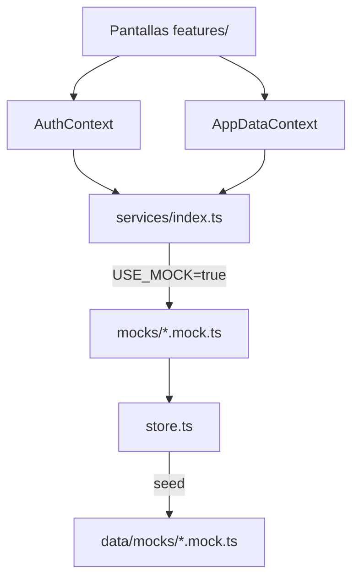
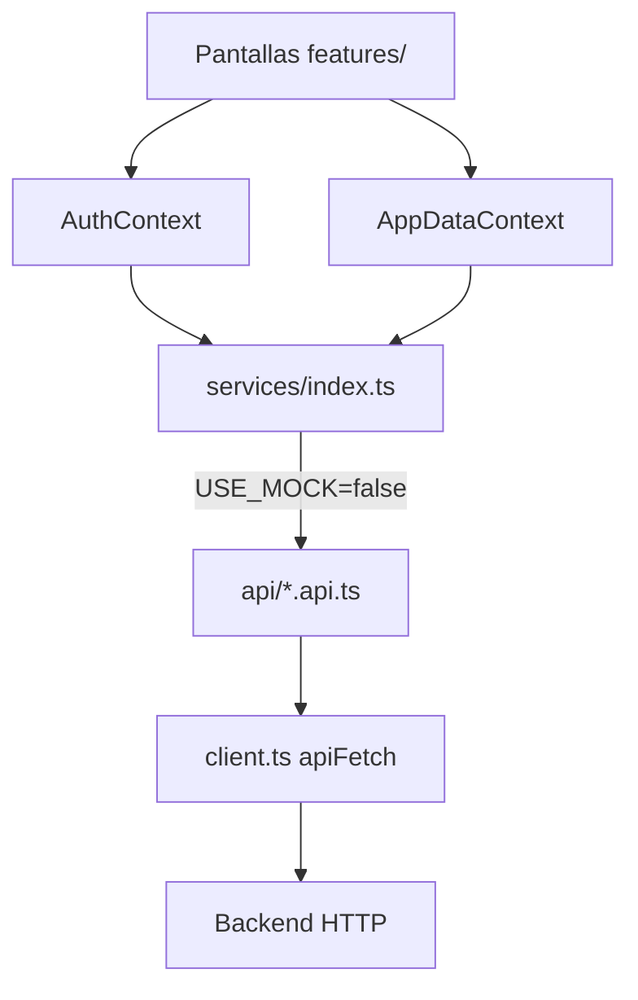

# Cómo funcionan los datos (Mock vs API)

Guía rápida: **dónde va cada cosa** según el modo de la app.

---

## Resumen

Hay **un solo interruptor**. Según su valor, la app usa una capa u otra, pero **las pantallas siempre hablan igual** (vía contextos).

```
Pantallas (features/)
       ↓
AuthContext / AppDataContext
       ↓
src/services/index.ts   ← elige mock o api
       ↓
┌──────────────────┬──────────────────┐
│  USE_MOCK=true   │ USE_MOCK=false   │
│  mocks/*.mock.ts │  api/*.api.ts    │
│  + store.ts      │  + client.ts     │
│  + data/mocks/   │  → backend HTTP  │
└──────────────────┴──────────────────┘
```

---

## El interruptor

| Archivo | Qué hace |
|---------|----------|
| `src/constants/config.ts` | `USE_MOCK` (default `true`) y `API_BASE_URL` |
| `.env` | `EXPO_PUBLIC_USE_MOCK=false` y `EXPO_PUBLIC_API_URL=https://...` |

```ts
// src/constants/config.ts
USE_MOCK = process.env.EXPO_PUBLIC_USE_MOCK !== 'false'
```

- **Mock (ahora):** no hace falta `.env`, o `EXPO_PUBLIC_USE_MOCK=true`
- **API real:** `EXPO_PUBLIC_USE_MOCK=false` + URL del backend

---

## Modo MOCK — carpetas y archivos

### 1. Datos iniciales (solo lectura al arrancar)

```
src/data/mocks/
├── index.ts              # reexporta todo
├── users.mock.ts         # usuarios demo (auxiliar, padres, alumno)
├── entries.mock.ts       # anotaciones / comunicados
├── calendar.mock.ts      # eventos del calendario
├── notifications.mock.ts
└── conversations.mock.ts
```

Son **JSON-like en TypeScript**: el seed de la demo. No se modifican en runtime; se copian al store.

### 2. Store en memoria (lectura/escritura en sesión)

```
src/services/mocks/store.ts
```

- Carga `MOCK_*` de `data/mocks/` al iniciar
- Guarda cambios mientras la app está abierta (crear anotación, confirmar lectura, etc.)
- Al recargar la app, vuelve al seed original
- Exporta helpers: `createEntryInStore`, `confirmEntryReadInStore`, `getStudentName`, etc.

### 3. Servicios mock (misma firma que la API)

```
src/services/mocks/
├── auth.mock.ts
├── entries.mock.ts
├── calendar.mock.ts
├── notifications.mock.ts
├── chat.mock.ts
└── students.mock.ts
```

Cada archivo **implementa las mismas funciones** que su par en `api/`, pero lee/escribe en `mockStore`.

Ejemplo de flujo al confirmar lectura:

```
EntryDetailModal
  → AppDataContext.confirmEntryRead()
    → entriesService.confirmEntryRead()   // entries.mock.ts
      → confirmEntryReadInStore()         // store.ts
        → mockStore.entries[i].readBy.push(userId)
```

### 4. Factory (elige mock)

```
src/services/index.ts
```

```ts
export const entriesService = USE_MOCK ? entriesMock : entriesApi;
export const authService      = USE_MOCK ? authMock      : authApi;
// ... calendar, notifications, chat, students
```

**Siempre importá desde aquí**, no desde `mocks/` ni `api/` directo en pantallas.

### 5. Contextos (puente hacia la UI)

```
src/contexts/
├── AuthContext.tsx       # login/logout → authService
└── AppDataContext.tsx    # entries, calendario, notifs, chat → *Service
```

Las pantallas usan:

- `useAuth()` → usuario, hijo/sección seleccionados
- `useAppData()` → listas y acciones (addEntry, confirmEntryRead, …)

**Las pantallas en `src/features/` no deberían importar `data/mocks/`** (salvo excepciones pendientes de migrar).

---

## Modo API — carpetas y archivos

### 1. Cliente HTTP

```
src/services/api/client.ts
```

- `apiFetch(path, options)` → `fetch` a `API_BASE_URL + path`
- `ApiError` para respuestas fallidas
- `notImplemented()` — lo que usan los stubs hoy

### 2. Stubs de endpoints (implementar acá)

```
src/services/api/
├── auth.api.ts           # POST /auth/login, GET /auth/session, …
├── entries.api.ts        # GET/POST/PATCH/DELETE /entries, POST …/read
├── calendar.api.ts       # /calendar/events
├── notifications.api.ts
├── chat.api.ts
└── students.api.ts
```

**Estado actual:** casi todo llama a `notImplemented('GET /entries')` etc. Hay que reemplazar cada función con un `apiFetch` real.

Ejemplo objetivo:

```ts
// entries.api.ts (cuando conectes backend)
export async function listEntries(params?: ListEntriesParams): Promise<Entry[]> {
  const qs = new URLSearchParams(params as Record<string, string>).toString();
  return apiFetch<Entry[]>(`/entries?${qs}`);
}
```

### 3. Misma factory

```
src/services/index.ts   → USE_MOCK=false usa *.api.ts
```

Los contextos **no cambian**: siguen llamando `entriesService.listEntries()`.

### 4. Lo que ya no se usa en producción

| Carpeta | Rol con API real |
|---------|------------------|
| `src/data/mocks/` | Solo tests o dev local; no en prod |
| `src/services/mocks/` | Desactivado vía `USE_MOCK=false` |
| `src/services/mocks/store.ts` | Desactivado; el backend es la fuente de verdad |

---

## Mapa servicio → archivos

| Dominio | Mock | API (stub) | Tipos |
|---------|------|------------|-------|
| Auth | `mocks/auth.mock.ts` | `api/auth.api.ts` | `src/types/user.ts` |
| Anotaciones | `mocks/entries.mock.ts` | `api/entries.api.ts` | `src/types/entry.ts` |
| Calendario | `mocks/calendar.mock.ts` | `api/calendar.api.ts` | `src/types/calendar.ts` |
| Notificaciones | `mocks/notifications.mock.ts` | `api/notifications.api.ts` | `src/types/…` |
| Chat | `mocks/chat.mock.ts` | `api/chat.api.ts` | `src/types/chat.ts` |
| Alumnos/padres | `mocks/students.mock.ts` | `api/students.api.ts` | `src/types/user.ts` |

---

## Quién llama a qué (UI)

| Capa | Archivos típicos | Acceso a datos |
|------|------------------|----------------|
| Rutas | `app/(tabs)/*.tsx`, `app/(modals)/*.tsx` | Solo importan pantallas de `features/` |
| Pantallas | `src/features/**/*.tsx` | `useAuth()`, `useAppData()` |
| Componentes | `src/components/features/*.tsx` | Props o contextos; a veces `getStudentName` de `@/services` |
| Contextos | `src/contexts/*.tsx` | `*Service` desde `@/services/index.ts` |

### Excepciones actuales (acopladas al mock)

Estos archivos importan `data/mocks` directo — conviene migrarlos cuando pases a API:

- `src/features/entries/NuevaAnotacionScreen.tsx` → `MOCK_STUDENTS`
- `src/utils/ack.ts` → `MOCK_USERS`, `MOCK_STUDENTS` (lista de padres que confirmaron)

---

## Cómo pasar de mock a API (checklist)

1. Implementar funciones en `src/services/api/*.api.ts` con `apiFetch`.
2. Poner `EXPO_PUBLIC_API_URL` y `EXPO_PUBLIC_USE_MOCK=false` en `.env`.
3. Probar login → `AuthContext` debe recibir `User` del backend.
4. Verificar que `AppDataContext.refreshAll()` carga entries, calendar, notifications, chat.
5. Reemplazar imports directos a `data/mocks` en pantallas/utils.
6. Opcional: mantener mock para desarrollo offline con `USE_MOCK=true`.

---

## Tipos compartidos (ambos modos)

```
src/types/
├── index.ts
├── user.ts
├── entry.ts
├── calendar.ts
├── chat.ts
└── …
```

Mock y API devuelven **los mismos tipos**. El contrato vive en los `.api.ts` (params, DTOs) y en `src/types/`.

---

## Diagrama completo MOCK



## Diagrama completo API


