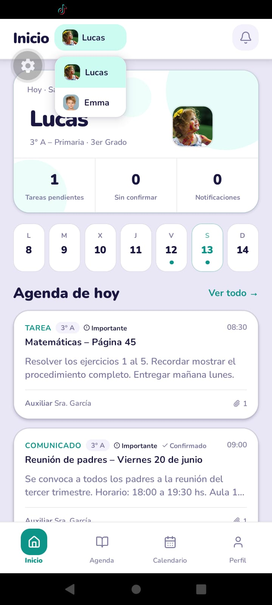
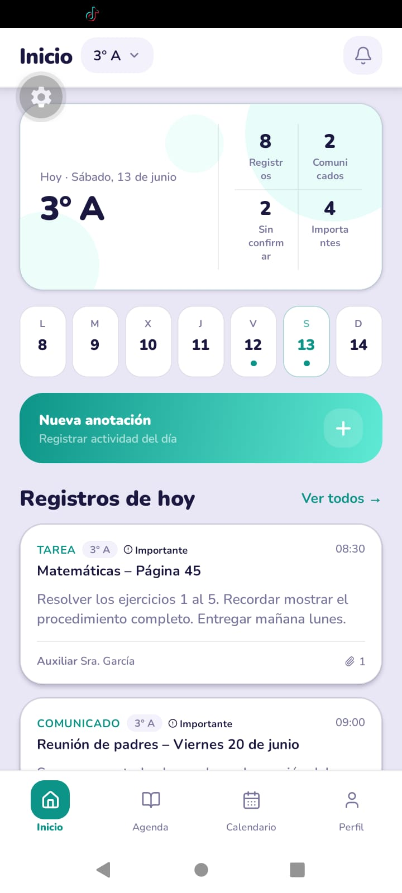
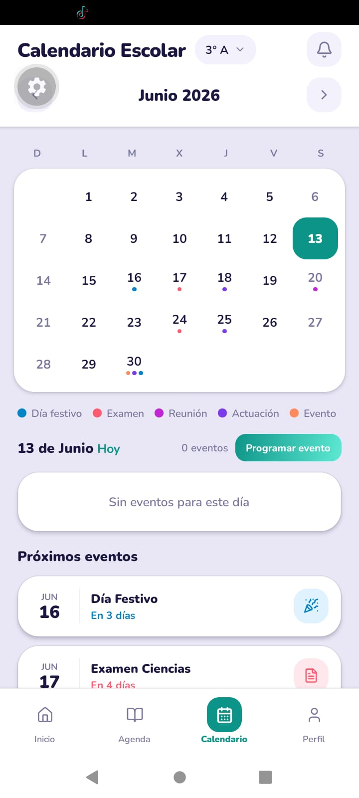
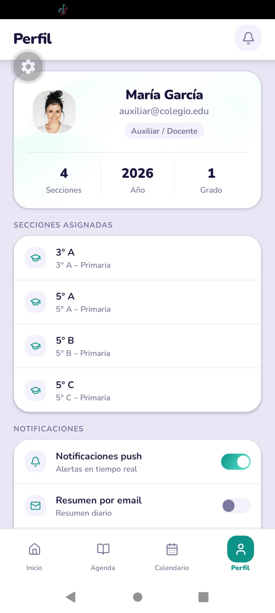
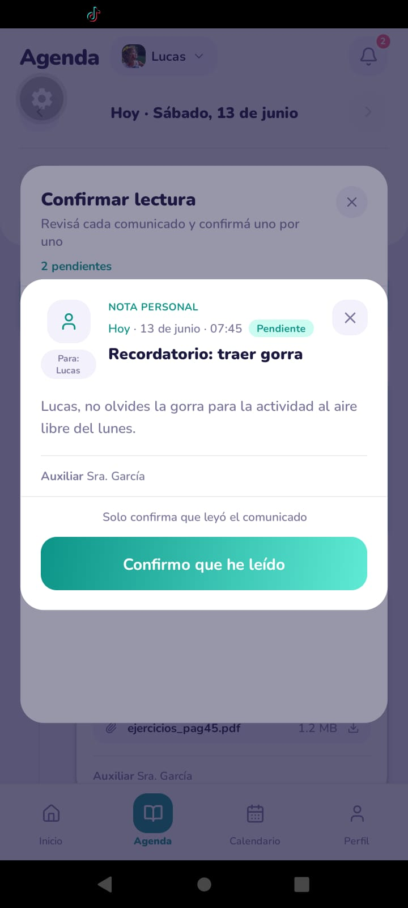

# Agenda Escolar Digital

App mobile (Expo / React Native) para gestión escolar: anotaciones, calendario, notificaciones y perfil. Incluye datos mock y arquitectura lista para conectar una API real.

**Stack:** Expo SDK 56 · React Native 0.85 · Expo Router · TypeScript · **Zustand** · **TanStack Query** · Nunito · Lucide icons

---

## Requisitos

- Node.js 18+
- pnpm (recomendado) o npm
- [Expo Go](https://expo.dev/go) en el teléfono, o emulador Android / iOS

## Inicio rápido

```bash
pnpm install
pnpm start
```

Escaneá el QR con Expo Go, o en la terminal: `a` (Android) · `i` (iOS).

Variables opcionales (copiá `.env.example` → `.env`):

| Variable | Default | Descripción |
|----------|---------|-------------|
| `EXPO_PUBLIC_USE_MOCK` | `true` | Datos en memoria vs API |
| `EXPO_PUBLIC_API_URL` | `https://api.example.com` | Base URL del backend |

---

## Roles y pantallas

| Tab | Auxiliar / docente | Padre | Alumno |
|-----|-------------------|-------|--------|
| **Inicio** | Resumen del día, secciones, accesos rápidos | Dashboard por hijo, banner de lecturas pendientes | Saludo y resumen propio |
| **Agenda** | Crear / editar anotaciones por sección | Solo lectura; confirmar lectura en comunicados | Solo lectura |
| **Calendario** | Crear eventos escolares | Ver eventos | Ver eventos |
| **Perfil** | Ajustes, modo oscuro, cerrar sesión | Idem + selector de hijos en otras pantallas | Idem |

### Flujos clave

- **Confirmar lectura (padre):** banner en Inicio/Agenda → lista guiada → detalle → botón *Confirmo que he leído*.
- **Seguimiento auxiliar:** en un comunicado con acuse, ver cuántos padres confirmaron (lista X/Y).
- **Nueva anotación:** botón flotante en Agenda (auxiliar) → tipos: tarea, comunicado, examen, etc.

> Fecha fija del mock: **13 de junio de 2026** (`TODAY` en `src/constants/config.ts`).

---

## Cuentas demo

### Modo mock (`EXPO_PUBLIC_USE_MOCK=true`, default)

Contraseña: **cualquier valor** (el mock no la valida). Podés usar código o email legacy:

| Rol | Código | Email (legacy) |
|-----|--------|----------------|
| Auxiliar | `t10000001` | `auxiliar@colegio.edu` |
| Padre | `p10000001` | `padre@colegio.edu` |
| Alumno | `e10000001` | `alumno@colegio.edu` |

En mock también existen padre extra (`padre2@colegio.edu`) y más datos de demo en `src/data/mocks/`.

### Modo API (`EXPO_PUBLIC_USE_MOCK=false`)

Requiere el backend Nest en `api/` con migraciones y seed:

```bash
cd api
pnpm db:migrate
psql $DATABASE_URL -f database/seed-dev.sql
pnpm start:dev
```

| Rol | Código | Contraseña |
|-----|--------|------------|
| Auxiliar | `t10000001` | `demo123` |
| Padre | `p10000001` | `demo123` |
| Alumno | `e10000001` | `demo123` |

Copiá `.env.example` → `.env` en `mobil/` y ajustá `EXPO_PUBLIC_API_URL` (ver comentarios en el archivo).

---

## Capturas esenciales

### Login

<p align="center">
  
</p>

Pantalla de ingreso con cuentas demo.

### Inicio (padre)

<p align="center">
  
</p>

Dashboard del padre: selector de hijo, fecha del día y banner de lecturas pendientes.

### Inicio (auxiliar)

<p align="center">
  
</p>

Resumen del día, stats y accesos rápidos para el auxiliar/docente.

### Agenda

<p align="center">
  
</p>

Lista de anotaciones del día con filtros y tipos de entrada.

### Calendario

<p align="center">
  
</p>

Vista mensual con eventos del día seleccionado.

### Perfil

<p align="center">
  
</p>

Datos del usuario, rol, stats y ajustes (modo oscuro, cerrar sesión).

### Confirmar lectura (padre)

<p align="center">
  
</p>

Modal con lista numerada de comunicados pendientes de confirmar.

<p align="center">
  
</p>

Detalle del comunicado con botón *Confirmo que he leído*.

---

## Estructura del proyecto

```
app/                    # Rutas Expo Router (pantallas delgadas)
src/
  theme/                # Colores, tipografía, spacing, modo oscuro
  types/                # Tipos TypeScript
  constants/            # Config, labels, tipos de anotación
  data/mocks/           # Datos estáticos
  services/
    api/                # Cliente HTTP, mappers, tokenStore
    mocks/              # Store en memoria (dev)
    *.service.ts        # Facades con firma única mock/API
  store/                # Zustand (auth + persist)
  queries/              # TanStack Query hooks
  components/
    ui/                 # Button, Modal, TodayDateText, etc.
    features/           # EntryCard, PendingAckGuideModal, etc.
    layout/             # TopBar, HomeTopBar
  features/             # Pantallas por dominio (auth, agenda, profile…)
  utils/                # Fechas, visibilidad, ack de lectura
assets/                 # Iconos, splash, avatares mock
docs/screenshots/       # Capturas para este README
```

Las pantallas usan `useAuth()` (Zustand) y hooks de `@/queries/` (TanStack Query). Ver [docs/datos-y-servicios.md](docs/datos-y-servicios.md).

---

## Tema global

Todo el diseño pasa por `src/theme/`:

- `light.ts` / `dark.ts` — paletas claro y oscuro
- `ThemeProvider` + `useTheme()` — persistido en AsyncStorage
- `styles.ts` — helpers (`selectionStyle`, `datePillStyle`, `cardShadow`)

---

## Mock → API

Por defecto `USE_MOCK = true` en `src/constants/config.ts`.

Para API real:

1. Levantá el backend (`api/`) con seed de desarrollo
2. Copiá `mobil/.env.example` → `mobil/.env`
3. `EXPO_PUBLIC_USE_MOCK=false` y `EXPO_PUBLIC_API_URL` apuntando al servidor (ej. `http://10.0.2.2:3000` en emulador Android)
4. Login con **código** + contraseña (`t10000001` / `demo123`)

La capa HTTP está en `src/services/api/`:

| Archivo | Rol |
|---------|-----|
| `client.ts` | Envelope `{ success, data, error }`, JWT Bearer, refresh en 401 |
| `tokenStore.ts` | Persistencia de access/refresh tokens |
| `mappers.ts` | DTOs API → tipos móvil |
| `*.api.ts` | Endpoints por dominio |

| Servicio | Endpoints |
|----------|-----------|
| auth | `POST /auth/login`, `POST /auth/logout`, `PATCH /auth/password`, sesión vía `GET /users/me` |
| entries | CRUD + `POST /entries/:id/read` |
| calendar | CRUD `/calendar/events` |
| notifications | `/notifications`, unread-count, marcar leídas |
| chat | `/conversations` |
| students | `/students`, `/parents`, `/users/me` |

**Fase 2:** subida de adjuntos (Cloudinary) — la UI puede mostrar nombres locales pero no se envían al backend.

---

## Scripts

| Comando | Descripción |
|---------|-------------|
| `pnpm start` | Servidor de desarrollo Expo |
| `pnpm android` | Abrir en Android |
| `pnpm ios` | Abrir en iOS |
| `pnpm lint` | Chequeo TypeScript (`tsc --noEmit`) |

---
