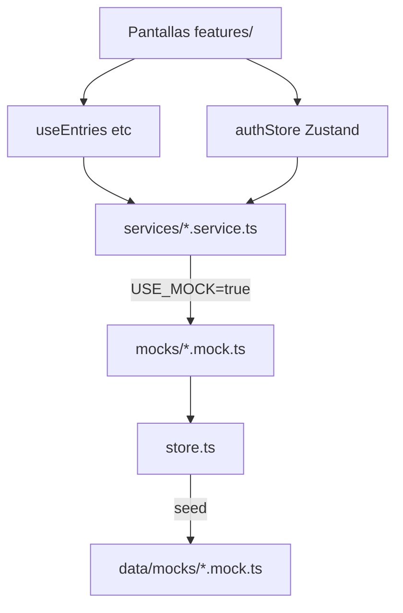
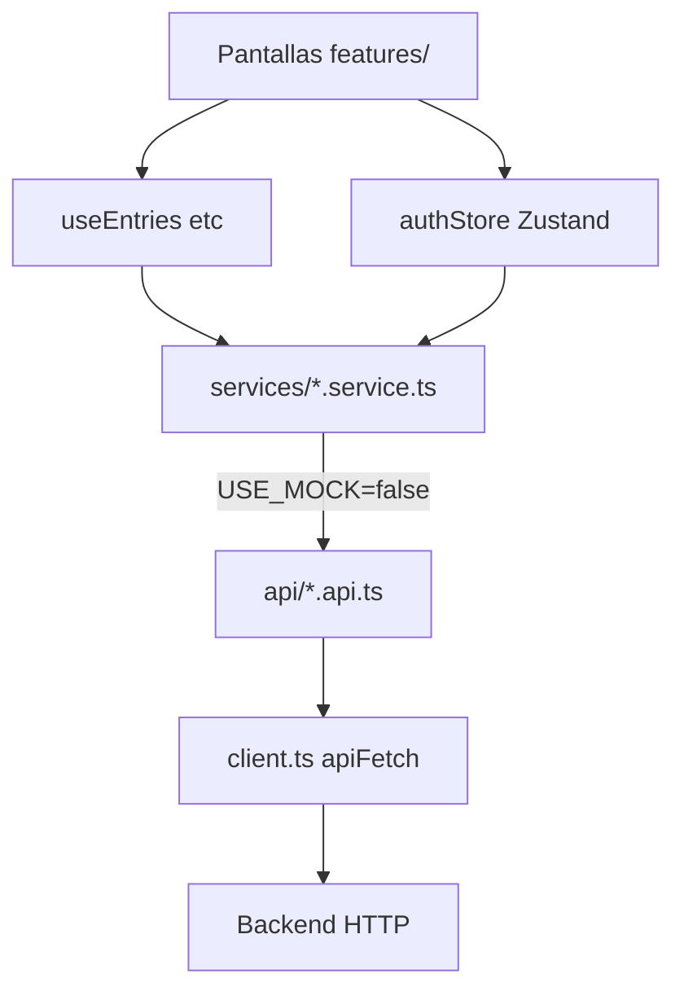

# Cómo funcionan los datos (Mock vs API)

Guía rápida: **dónde va cada cosa** según el modo de la app.

---

## Resumen

Hay **un solo interruptor**. Según su valor, la app usa mock o API, pero **las pantallas hablan con hooks y store**, no con contextos.

```
Pantallas (features/)
       ↓
useAuth() (Zustand)  +  useEntries / useCalendarEvents / … (TanStack Query)
       ↓
src/services/*.service.ts   ← facades con firma única
       ↓
┌──────────────────┬──────────────────┐
│  USE_MOCK=true   │ USE_MOCK=false   │
│  mocks/*.mock.ts │  api/*.api.ts    │
│  + store.ts      │  + client.ts     │
│  + data/mocks/   │  → backend HTTP  │
└──────────────────┴──────────────────┘
```

---

## El interruptor

| Archivo | Qué hace |
|---------|----------|
| `src/constants/config.ts` | `USE_MOCK` (default `true`) y `API_BASE_URL` |
| `.env` | `EXPO_PUBLIC_USE_MOCK=false` y `EXPO_PUBLIC_API_URL=https://...` |

```ts
// src/constants/config.ts
USE_MOCK = process.env.EXPO_PUBLIC_USE_MOCK !== 'false'
```

- **Mock (ahora):** no hace falta `.env`, o `EXPO_PUBLIC_USE_MOCK=true`
- **API real:** `EXPO_PUBLIC_USE_MOCK=false` + URL del backend

---

## Modo MOCK — carpetas y archivos

### 1. Datos iniciales (solo lectura al arrancar)

```
src/data/mocks/
├── index.ts              # reexporta todo
├── users.mock.ts         # usuarios demo (auxiliar, padres, alumno)
├── entries.mock.ts       # anotaciones / comunicados
├── calendar.mock.ts      # eventos del calendario
├── notifications.mock.ts
└── conversations.mock.ts
```

Son **JSON-like en TypeScript**: el seed de la demo. No se modifican en runtime; se copian al store.

### 2. Store en memoria (lectura/escritura en sesión)

```
src/services/mocks/store.ts
```

- Carga `MOCK_*` de `data/mocks/` al iniciar
- Guarda cambios mientras la app está abierta (crear anotación, confirmar lectura, etc.)
- Al recargar la app, vuelve al seed original
- Exporta helpers: `createEntryInStore`, `confirmEntryReadInStore`, `getStudentName`, etc.

### 3. Servicios mock (misma firma que la API)

```
src/services/mocks/
├── auth.mock.ts
├── entries.mock.ts
├── calendar.mock.ts
├── notifications.mock.ts
├── chat.mock.ts
└── students.mock.ts
```

Cada archivo **implementa las mismas funciones** que su par en `api/`, pero lee/escribe en `mockStore`.

Ejemplo de flujo al confirmar lectura:

```
EntryDetailModal
  → AppDataContext.confirmEntryRead()
    → entriesService.confirmEntryRead()   // entries.mock.ts
      → confirmEntryReadInStore()         // store.ts
        → mockStore.entries[i].readBy.push(userId)
```

### 4. Facades (firma única mock + API)

```
src/services/
├── auth.service.ts
├── entries.service.ts
├── calendar.service.ts
├── notifications.service.ts
├── chat.service.ts
├── students.service.ts
└── index.ts              # reexporta facades
```

**Importá siempre desde `@/services`**, no desde `mocks/` ni `api/` en pantallas.

### 5. Estado en la UI

```
src/store/
├── authStore.ts          # Zustand + persist (usuario, hijo, sección)
└── useAuth.ts            # hook useAuth()

src/queries/
├── queryClient.ts        # singleton TanStack Query
├── keys.ts               # queryKeys
├── useEntries.ts         # useQuery + mutations
├── useCalendarEvents.ts
├── useNotifications.ts
├── useConversations.ts
└── useStudents.ts
```

| Tipo de estado | Herramienta |
|----------------|-------------|
| Sesión, selección hijo/sección | **Zustand** (`useAuth`) |
| Entries, calendario, notifs, chat | **TanStack Query** |
| UI local (modal abierto, filtros) | `useState` en pantalla |

Las mutations invalidan solo su dominio (`queryKeys.entries`, etc.), no recargan todo.

**Las pantallas no importan `data/mocks/`** directamente.

---

## Modo API — carpetas y archivos

### 1. Cliente HTTP

```
src/services/api/
├── client.ts       # apiFetch, envelope, Bearer, refresh 401
├── tokenStore.ts   # access/refresh tokens en AsyncStorage
├── mappers.ts      # DTOs API → tipos móvil
└── types.ts        # tipos de respuesta del backend
```

- `apiFetch(path, options)` → parsea `{ success, data, error }` del backend Nest
- `ApiError` con mensaje del servidor
- JWT en header `Authorization`; en 401 intenta `POST /auth/refresh` una vez

### 2. Implementación de endpoints

```
src/services/api/
├── auth.api.ts           # POST /auth/login (code+password), GET /users/me
├── entries.api.ts        # GET/POST/PATCH/DELETE /entries, POST …/read
├── calendar.api.ts       # /calendar/events
├── notifications.api.ts
├── chat.api.ts
└── students.api.ts
```

**Estado actual:** implementados con `apiFetch` + mappers. Activar con `EXPO_PUBLIC_USE_MOCK=false`.

Ejemplo:

```ts
// entries.api.ts
export async function listEntries(params?: ListEntriesParams): Promise<Entry[]> {
  const data = await apiFetch<EntryResponseDto[]>(`/entries${buildQuery(params)}`);
  return data.map(mapEntry);
}
```

Login usa **código** (`t10000001`), no email. La sesión se restaura con `GET /users/me` y tokens en `tokenStore`.

### 3. Misma factory

```
src/services/index.ts   → USE_MOCK=false usa *.api.ts
```

Los hooks de Query **no cambian**: siguen llamando `listEntries()` etc. desde las facades.

### 4. Lo que ya no se usa en producción

| Carpeta | Rol con API real |
|---------|------------------|
| `src/data/mocks/` | Solo tests o dev local; no en prod |
| `src/services/mocks/` | Desactivado vía `USE_MOCK=false` |
| `src/services/mocks/store.ts` | Desactivado; el backend es la fuente de verdad |

---

## Mapa servicio → archivos

| Dominio | Mock | API (stub) | Tipos |
|---------|------|------------|-------|
| Auth | `mocks/auth.mock.ts` | `api/auth.api.ts` | `src/types/user.ts` |
| Anotaciones | `mocks/entries.mock.ts` | `api/entries.api.ts` | `src/types/entry.ts` |
| Calendario | `mocks/calendar.mock.ts` | `api/calendar.api.ts` | `src/types/calendar.ts` |
| Notificaciones | `mocks/notifications.mock.ts` | `api/notifications.api.ts` | `src/types/…` |
| Chat | `mocks/chat.mock.ts` | `api/chat.api.ts` | `src/types/chat.ts` |
| Alumnos/padres | `mocks/students.mock.ts` | `api/students.api.ts` | `src/types/user.ts` |

---

## Quién llama a qué (UI)

| Capa | Archivos típicos | Acceso a datos |
|------|------------------|----------------|
| Rutas | `app/(tabs)/*.tsx`, `app/(modals)/*.tsx` | Solo importan pantallas de `features/` |
| Pantallas | `src/features/**/*.tsx` | `useAuth()`, `useEntries()`, etc. |
| Componentes | `src/components/features/*.tsx` | Props, query hooks, `getStudentName` |
| Store | `src/store/authStore.ts` | Zustand persist + login/logout |
| Queries | `src/queries/*.ts` | TanStack Query → facades |

---

## Cómo pasar de mock a API (checklist)

1. Backend: `pnpm db:migrate` + `database/seed-dev.sql` en `api/`
2. `mobil/.env`: `EXPO_PUBLIC_USE_MOCK=false` y `EXPO_PUBLIC_API_URL`
3. Login con código seed (`t10000001` / `demo123`) → `authStore` recibe `User` mapeado
4. Verificar `useEntries()`, `useCalendarEvents()`, notificaciones y chat
5. Opcional: mock offline con `USE_MOCK=true`

---

## Tipos compartidos (ambos modos)

```
src/types/
├── index.ts
├── user.ts
├── entry.ts
├── calendar.ts
├── chat.ts
└── …
```

Mock y API devuelven **los mismos tipos**. El contrato vive en los `.api.ts` (params, DTOs) y en `src/types/`.

---

## Diagrama completo MOCK



## Diagrama completo API


